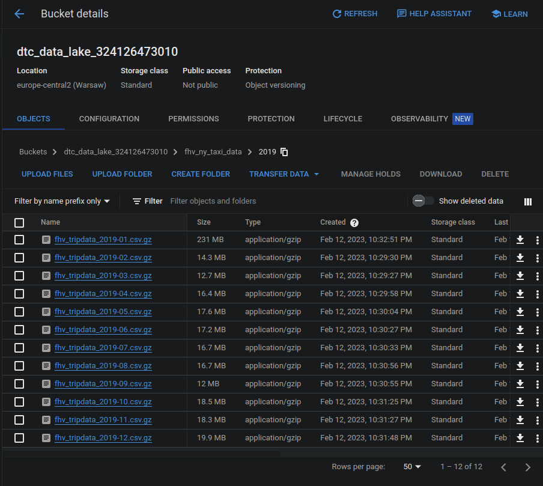
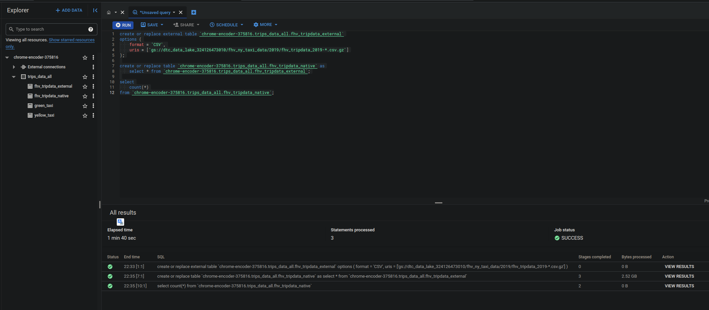
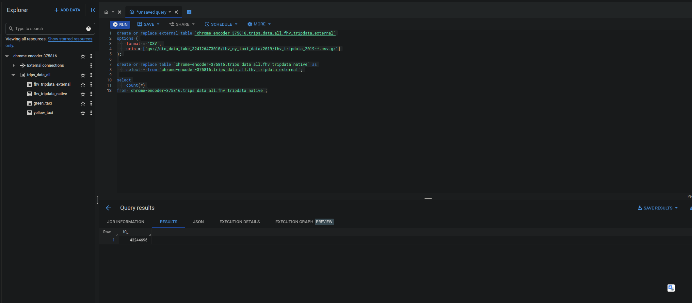
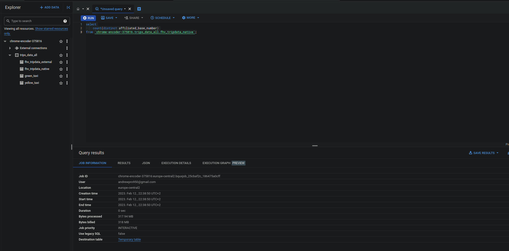
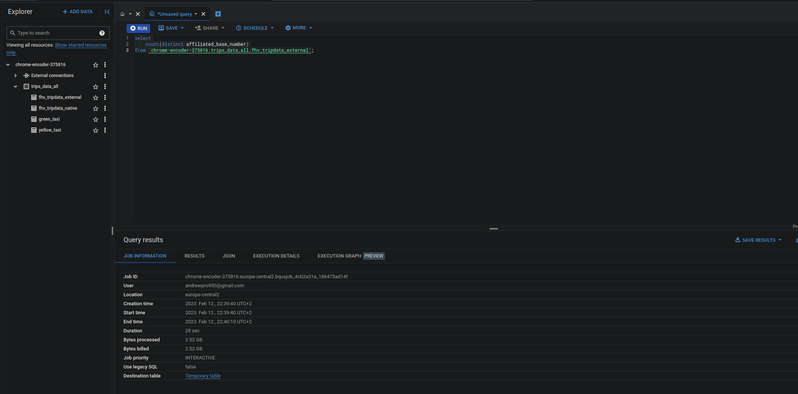
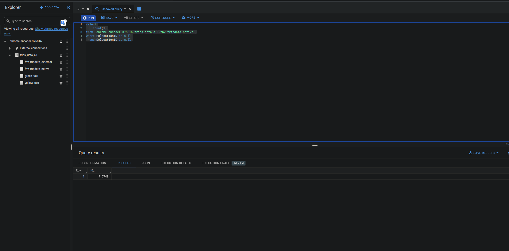
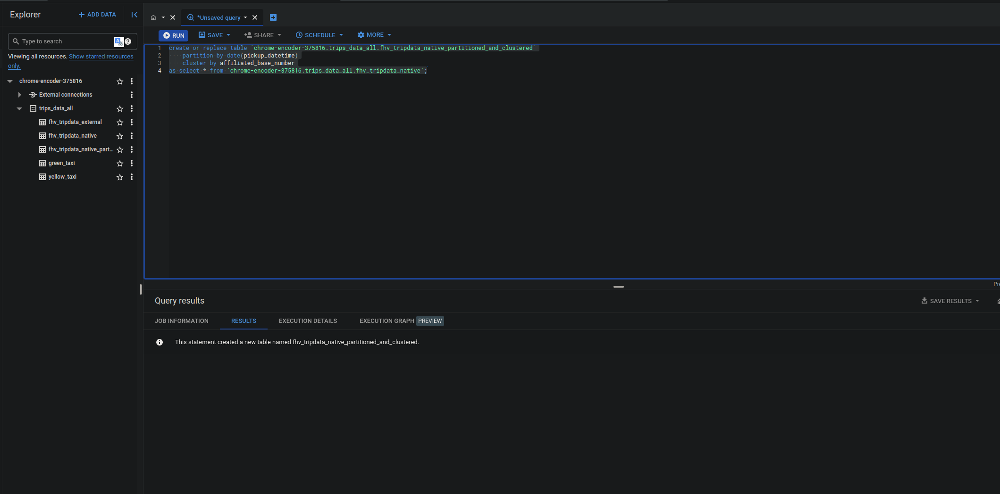
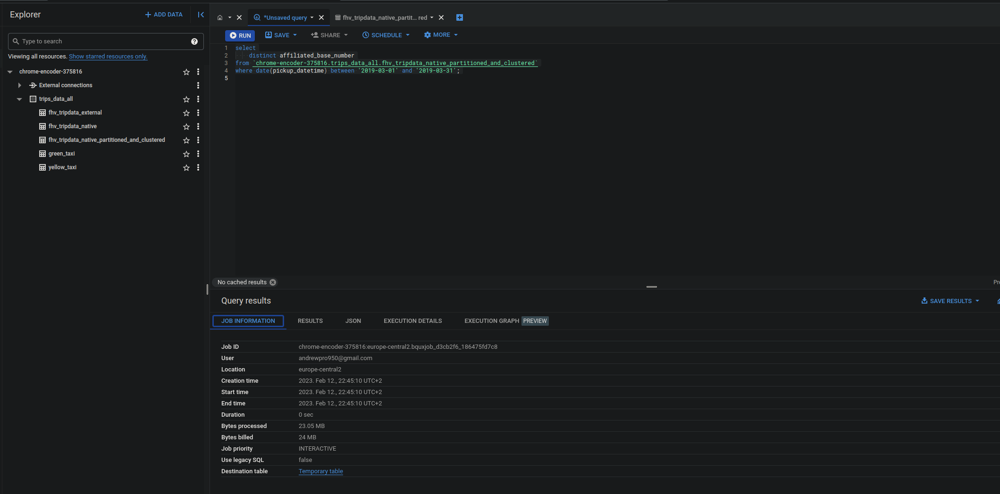

# Homework 3 for data-engineering-zoomcamp course

## Question 1

> 43,244,696

## Question 2

> 0 MB for the External Table and 317.94MB for the BQ Table

## Question 3

> 717,748 

## Question 4

> Partition by pickup_datetime Cluster on affiliated_base_number

## Question 5

> 647.87 MB for non-partitioned table and 23.06 MB for the partitioned table

## Question 6

> GCP Bucket

## Question 7

> False

## Question 8

> See main.py script